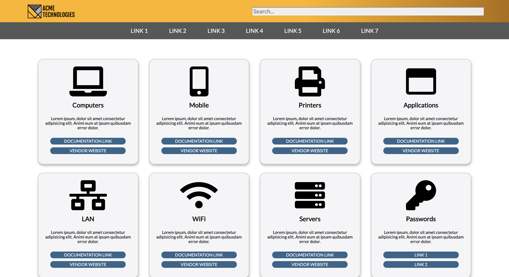
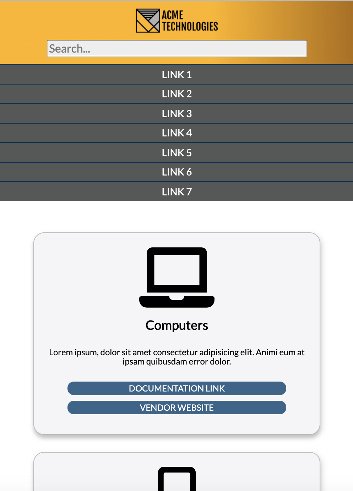

# Technical Support Portal
This webpage is designed to be a one-stop shop for tech support individuals who need to quickly access information and documentation for supporting devices, software, and accounts within an organization. It features a fully responsive design using a grid layout. Each product card can be configured with important reminders and policy information while the buttons can link to Vendor websites and other support documents.

### Languages: HTML, CSS

#### Desktop View:

#### Mobile View:

